# Hallym_UntiyProject (학교수업 프로젝트)

# 게임이름 : Simple Survive
### 팀원 : Jeehoon4545
### 장르 : 생존, RPG 
### 사용하는 언어 : C# Language
### 사용하는 프로그램 : MagicaVoxel, Blender, Unity 5

MagicaVoxel은 복셀3D 모델만드는 프로그램. [링크](http://ephtracy.github.io/)  
Blender는 복셀3D의 뼈대 만들어줄 용도로 사용. [링크](https://store.steampowered.com/app/365670/Blender/)  
Unity 5 게임엔진을 이용하여 게임을 제작. [링크](https://store.unity.com/kr/download?ref=personal)  
Sfxr 은 사운드 8비트를 만들어주는 프로그램 [링크](http://www.drpetter.se/project_sfxr.html)  \
[무료BGM](https://dova-s.jp/) 
{ 
라이선스
음악은 자유롭게 상업적으로 이용할 수도 있고, 필요에 따라선 페이드아웃이나 루프 등 기본적인 편집도 허용한다고 나와 있네요. 심지어 음원 사용 시 출처 표기가 의무가 아니라는 조항,
사이트 자체의 이용약관과는 별개로, 작곡가 개인은 '음원 사용 시 자신에게도 알려달라'는 요구사항 
} 

 
 
#### 강좌 : [블렌더](http://dlgnlfus.tistory.com/326?category=704959) [매지카복셀](https://www.youtube.com/watch?v=VPnQNp-GU9I)
 
 

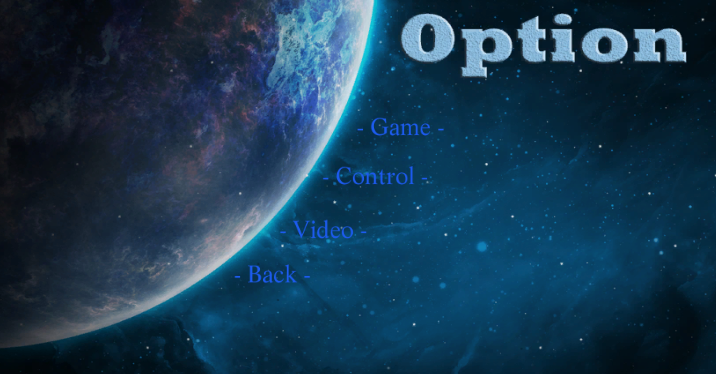

유용 오브젝트 누르고 Ctrl + Shift + F 누르면 오브젝트가 해당 보는 위치로 

### 1. 스토리
우주선에 탈출하여, 불시착을 한 상황이며 생존자는 단 1명 뿐이 었다. 
구조 요청을 보냈고 길어도 이 행성 시간 기준점으로 30일 걸릴거로 예상하고 그 때까지 혼자 살아남는 이야기이다. 
하지만 이곳 행성은 나무가 푸른색이며, 다른 동물들은 거의 호전적인 성향을 가지고 있으며, 주인공은 30일까지 무사히 버틸 수 있을까.. 

### 2. 주요기능
 + 인벤토리 기능
 + 목마름, 배고픔 구현
 + 건축 시스템 도입
 + 네비게이션을 이용한 몬스터 행동패턴
 + 난이도 기능

### 3. 개발목적
 + 유니티의 다양한 기술들을 배우고 싶어서 생존게임을 만들게 되었다.

### 4. 핵심코드
 +<b> Cs_TitleMenu </b> = 타이틀 화면을 총괄리 해주는 스크립트이며, 타이틀 화면, 옵션 화면을 자유롭게 오갈수 있도록 한다. 
 +<b> Cs_PlayerControl </b> = 플레이어의 걷기, 달리기, 점프, 카메라 회전을 할 수 있다. 즉, 직접 플레이어를 조종하는 주요 스크립트 
 +<b> Cs_PlayerStatus </b> = 플레이어의 HP,SP,배고픔,목마름 등 HUD와 현 상태에 대해 알 수 있으며, 이 스크립트는 플레이어의 심장부 역활을 한다. 
 +<b> Cs_ItemPickup </b> = 아이템 상자에 넣는 스크립트이며, 아이템을 먹을 수 있도록 유도해주는 스크립트이다. 
 +<b> Cs_Inventory </b> = 아이템 창 UI를 구현한 스크립트이며, I 키를 누르면 인벤토리 창이 나타나게 된다. 
 +<b> Cs_Slot </b> = 아이템 창의 슬롯들에 넣어지는 스크립트이며, 아이템 추가, 드래그, 먹기 등 다양한 기능이 들어있는 스크립트이다. 
 +<b> Cs_DragSlot </b> = 아이템창 슬롯에 있는 아이템을 드래그 시킬 수 있는 기능 스크립트 
 +<b> Cs_Cloude </b> = 이 스크립트는 구름을 회전시키고, 태양을 이용하여 밤 낮을 추가시켜 실감나게 플레이 할 수 있도록 만들어진 스크립트이다. 
 +<b> Cs_SoundManager </b> = 사운드 총괄하는 스크립트이며, 모든 스크립트에서 사용 가능하도록 제작되어 있다. 
 +<b> LowPolyWater </b> = 파도치는 물 (AssetStore)에서 구해왔다. 
 +<b> Item </b> = 아이템 파일을 만들어 해당 아이템의 정보를 담은 스크립트 
 +<b> Enemy </b> = 몬스터 파일을 만들어 해당 몬스터의 정보를 담은 스크립트 
 +<b> Cs_EnemyHud </b> = 몬스터를 때릴 경우, 몬스터의 HP를 화면에 표시시키는 UI Script  
 +<b> Cs_CrosbarHUD </b> = 플레이어 조준점 만들어주는 스크립트 
 +<b> Cs_WeaponControl </b> = 마우스 왼쪽버튼클릭하면 총알 
 +<b> Cs_BadEnding </b> = 게임에서 패배 할 때 나타내는 스크립트 
 +<b> Cs_Ending </b> = 승리할 시 나타내는 스크립트 
 +<b> Cs_EnemyInfomation </b> = 몬스터 정보를 나타내는 스크립트 (AI 인공지능 Nav Mash)를 이용하여 사용 
 +<b> Cs_Spawn </b> = 몬스터를 소환 
 +<b> Cs_ItemEffectDB </b> = 아이템 특수효과 총집합체 스크립트 
 +<b> Cs_ItemController </b> = 아이템을 습득 관련된 스크립트 
 +<b> Cs_CraftMenu </b> = 건축 시설 스크립트 
 +<b> Cs_EnemyHub </b> = 몬스터 HUD 
 +<b> Cs_PreviewObject </b> = 충돌 오브젝트 콜라이더를 저장하여 건설 불가능한 지역을 설정하는 스크립트 (미확인 오류로 인하여 사용보류) 
 +<b> Cs_SlotTooltip </b> = 아이템 설명서 
 
 
### 5. 조작방법

+<b> WASD </b> = 방향키  
+<b> Tab </b> = 건축  
+<b> I </b> = 인벤토리  
+<b> O </b> = 스텟창  
+<b> Q </b> = 무기 / 채광모드  
+<b> Space </b> = 점프  
+<b> E </b> = 아이템 먹기  

### 6. 게임방법
1. 30일을 버티면 승리합니다.  
2. 몬스터를 잡거나 나무를 격파하면 아이템을 획득할 수 있습니다. 
3. 나무 잡으면 포인트를 주는 아이템을 획득하지만, 몹을 잡으면 회복아이템을 얻을 수 있습니다. 
4. 적은 가만히 있다가 일정범위 들어오면 다가오며, 난이도에 따라 적의 전투력이 배로 상승합니다. 
5. 난이도 설정은 옵션가서 바꾸실 수 있습니다. 
6. 건축물에는 효과가 따로 있습니다. 

정수기는 물을 공급.
야광등은 빛을 밝혀주며,
침대는 회복을 해줍니다.

https://unity3d.com/kr/learn/tutorials/projects/survival-shooter/player-character?playlist=17144

### 7. 게임화면
- <b>옵션</b>
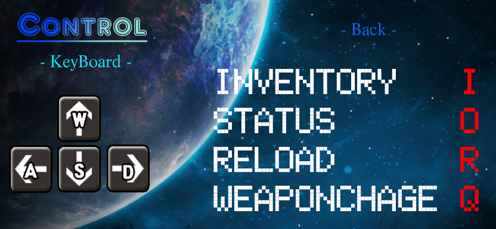 
단축키를 보는 옵션이다.
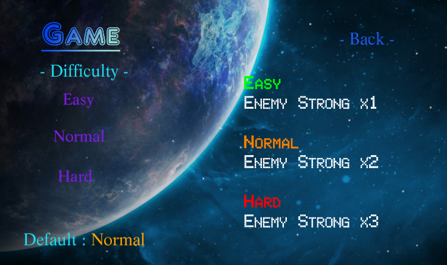 
난이도를 설정할 수 있는 옵션이다.
난이도가 높을 수록 적 애들은 강해진다.
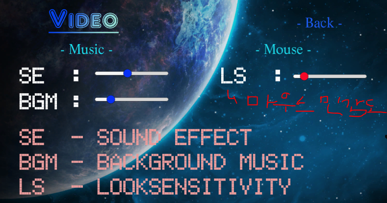 
SE, BGM 크기를 설정할 수 있으며, 게임을 나가도 저장할 수 있도록 하기위해 PlayerPrefs을 이용했다.

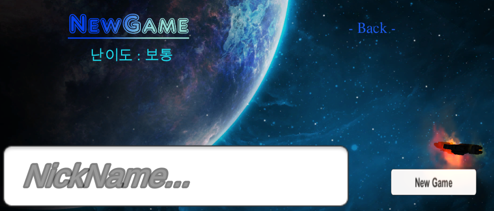 
새로운 게임을 시작하는 장소이다.
이름을 입력하면 다음에 스텟이 저장될 수 있도록 PlayerPrefs를 이용했다.

- <b>게임화면</b>
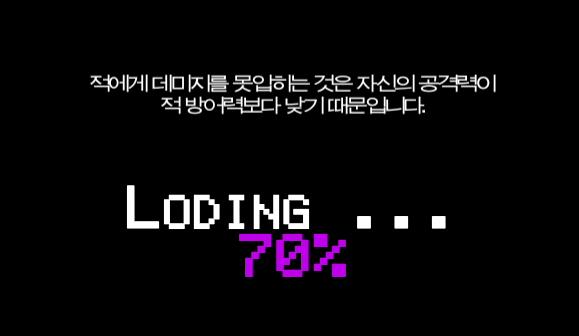 
로딩은 동작이 잘되도록 진행상태를 나타내며, 이 것은 AsyncOperation (비동기적 코루틴 수행)
코루틴 : 서브루틴, 멀티 태스킹(공용자원)구현하는 용도 사용
동기적 : 어떤 작업을 요청했을 때 그 작업이 종료될 때까지 기다린 후 다음(다른) 작업을 수행하는 방식.
비동기적 : 어떤 작업을 요청했을 때 그 작업이 종료될 때 까지 기다리지 않고 다른 작업을 하고 있다가, 요청했던 작업이 종료되면 그에 대한 추가 작업을 수행하는 방식

AsyncOperation 이것을 사용하여 로딩시스템을 구현 (인터넷 참조)

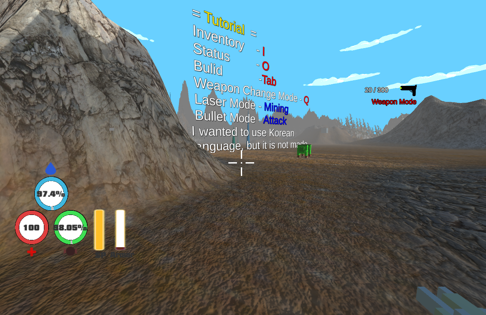 
게임 화면이다.

- <b>단축키</b>
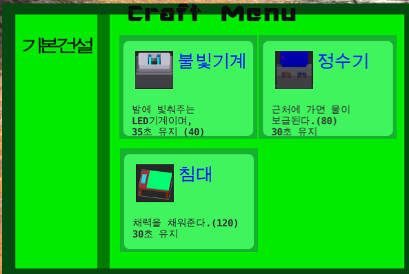 
Tab 키를 누르면 건설창을 뛰울 수 있다.
포인트는 Enemy를 잡아서 아이템을 먹으면 획득할 수 있다.

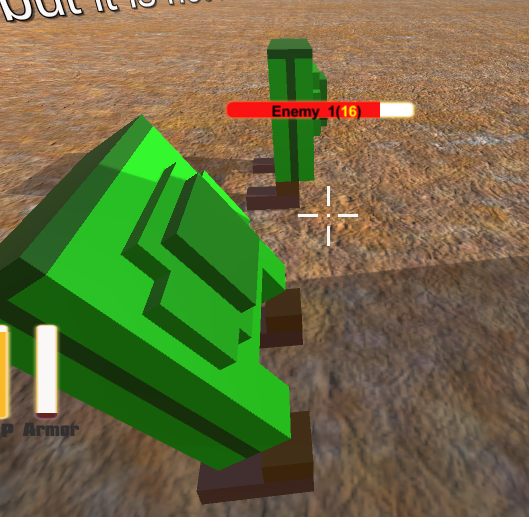 
이것이 몬스터이다. 시간 관계상... 몹은 3마리만 만들었으며, 유니티에서 제공하는 Navigation (몬스터 추적) 구현 방식을 사용했다.
3D 지형정보를 분석해서 추적영역과 그렇지 못한 곳에 대한 데이터를 얻는다.

플레이어를 감지 못할 경우에는 멈추는 상태로 납두었으며, 플레이어가 몬스터의 탐지거리안에 들어가면 추적시킨다.

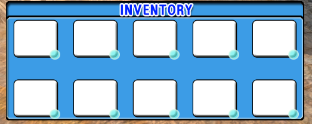 
인벤토리 창이다. (<b>I</b> Key)
위에 건설창 또한 포토샵으로 만든 것이며, 디자인 센스가 구리다는 것을 알 수 있었다.

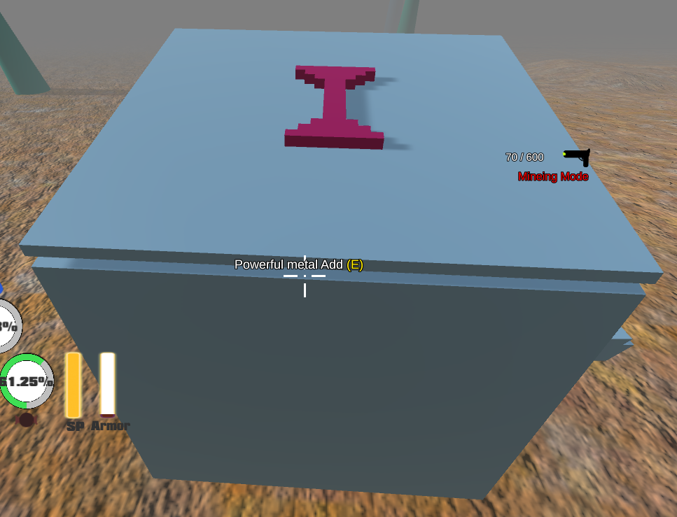 
이것은 아이템박스이며, 해당 몬스터나 촉수같이 생긴(광물)을 잡거나 캐면 나온다.
 
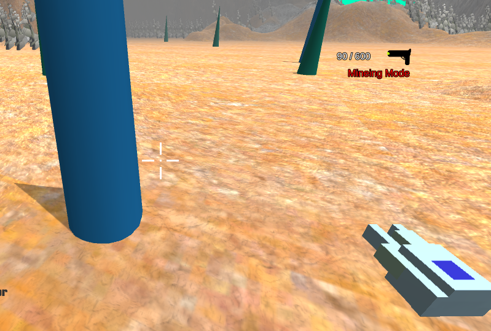 
 이 광물들은 많이 때리면 파괴할 수 있다. 아이템은 무조건 랜덤이며, 몬스터 고기가 드롭될 수 있다.

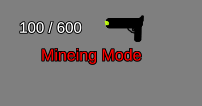 
모드변경 : 채광모드 (<b>Q</b> Key) 촉수같이 생긴(광물)을 캘 수 있으며, 엄청난 빛이 뿜어져 나온다.  
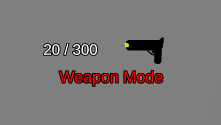 
모드변경 : 사냥모드 (<b>Q</b> Key) 총을 발사하면 샷것같은 발사 이펙트지만, 실제로는 한발 밖에 안맞는다. 시각적으로는 채광모드로 때리는게 더 아파 보인다. 

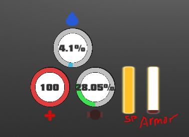 
빨간색 : 나의 건강상태를 나타내며, 0이 될 경우 당연히
파란색 : 나의 목마름을 나타내며, 0이 될 경우 당연히
초록색 : 나의 식량을 나타내며, 0이 될 경우 당연히
노란색 : 내가 뛰면 1씩 깎이며, 안 달릴 때는 1씩 회복한다.
갈색 : (Armor) 내 방어력이다. 
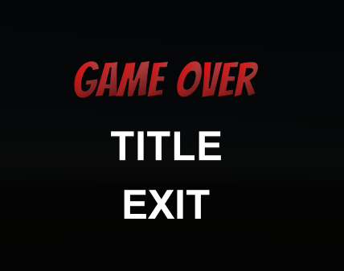 
뜬다.

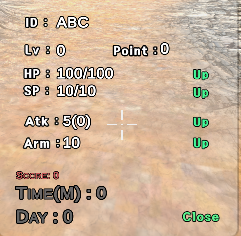 
나의 상태를 글씨로 나타내준다.
Day 30이 될 경우 승리하며, 일정 적을 잡다보면 레벨업을 해서 강해질 수 있도록 했다.

- <b>버그</b>
1. 아이템창에서 아이템에 커서를 가져다 놓으면 아이템 설명이 뜨는데, 그 상태로 키보드로 ESC 누르면 아이템창만 꺼진다.
2. 가끔 딜이 안박힐 때도 있다.

다음 게임을 만들때는 좀 더 면밀한 계획을 짜야 할 거 같다. 
