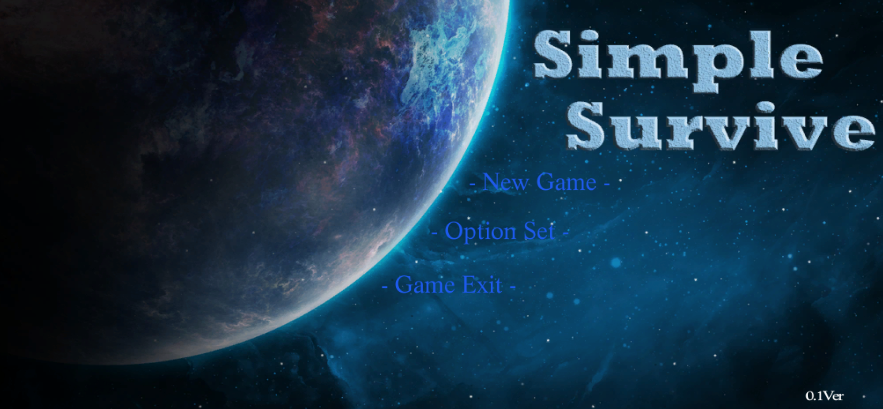

# Hallym_UntiyProject

# 게임이름 : Simple Survive
### 팀원 : Jeehoon4545
### 장르 : 생존, RPG 
### 사용하는 언어 : C# Language
### 사용하는 프로그램 : MagicaVoxel, Blender, Unity 5

MagicaVoxel은 복셀3D 모델만드는 프로그램. [링크](http://ephtracy.github.io/)  
Blender는 복셀3D의 뼈대 만들어줄 용도로 사용. [링크](https://store.steampowered.com/app/365670/Blender/)  
Unity 5 게임엔진을 이용하여 게임을 제작. [링크](https://store.unity.com/kr/download?ref=personal)  
Sfxr 은 사운드 8비트를 만들어주는 프로그램 [링크](http://www.drpetter.se/project_sfxr.html)  
 
#### 강좌 : [블렌더](http://dlgnlfus.tistory.com/326?category=704959), [매지카복셀](https://www.youtube.com/watch?v=VPnQNp-GU9I)
 
 

https://unity3d.com/kr/learn/tutorials/projects/survival-shooter/player-character?playlist=17144

